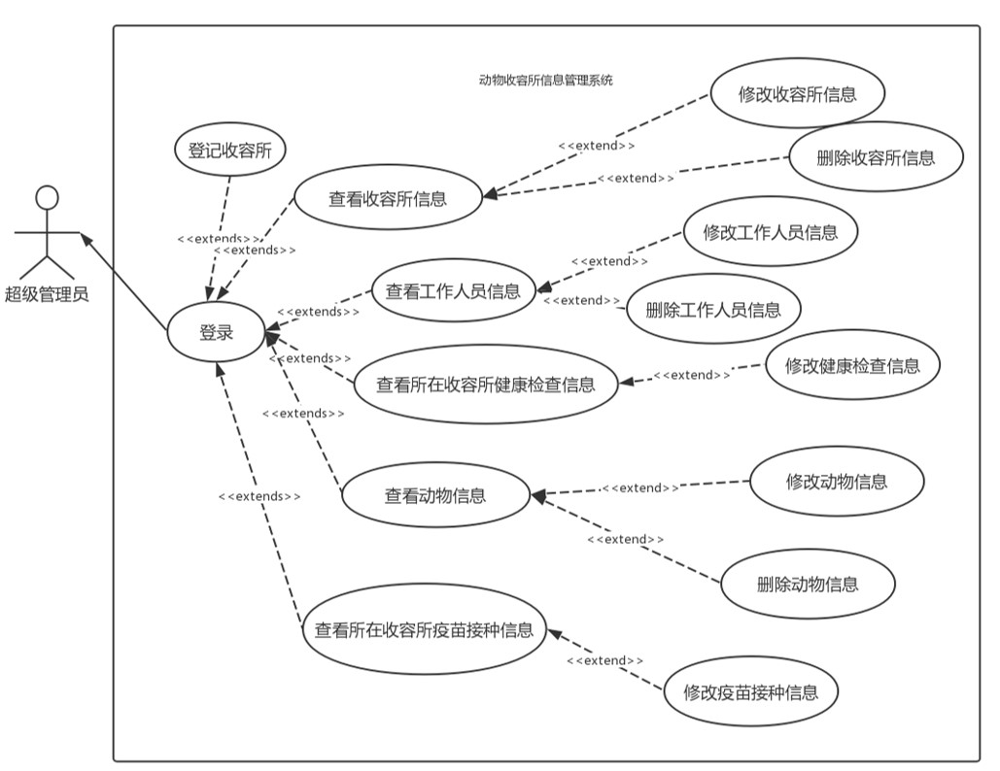
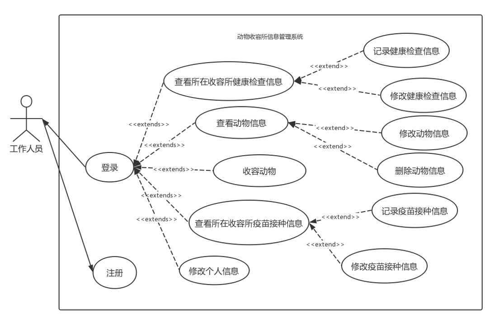
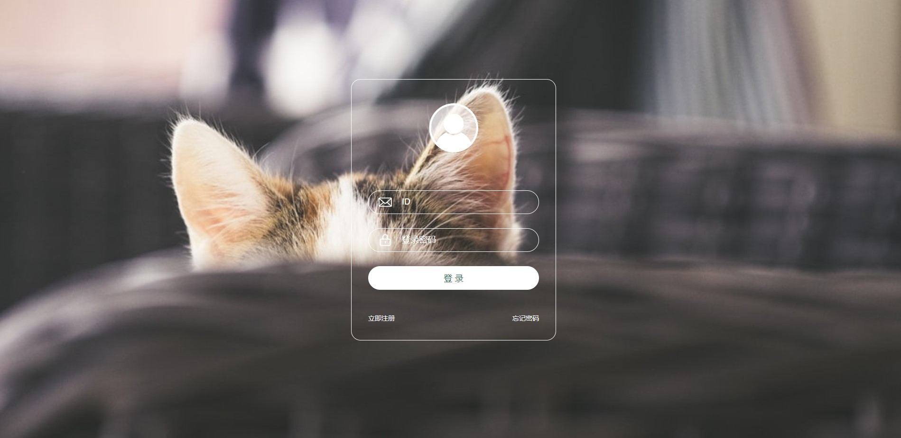

# 动物收容所信息管理系统
基于SOA架构的信息管理系统，前端bootstrap/jquery/ajax，后台spring/cxf,数据库oracle
## 数据库
### 表结构
* 超级管理员信息表（<u>管理员id</u>, 用户名，密码）
* 用户信息表(<u>用户id</u>, 用户名，密码, 邮箱，手机号，种类，收容所id) 
* 动物信息表（<u>动物id</u>, 动物编号，动物名，种类，性别，年龄，图像，收容所id）
* 收容所信息表(<u>收容所id</u>, 收容所名称，地址，邮编，总房间数，剩余房间数，备注)
* 健康信息表(<u>健康信息id</u>, 动物id, 用户id,健康信息，检查日期, 备注)
* 疫苗信息表(<u>疫苗信息id</u>, 动物id, 用户id, 疫苗名，接种时间, 备注)
## 数据流图

## 用例图
### 超级管理员

### 工作人员

## 界面展示
* 使用bootstrap模板[Gentelella](https://github.com/ColorlibHQ/gentelella.git "Gentelella")  
### 登录

### 收容动物

### 动物信息管理

### 健康检查信息管理

